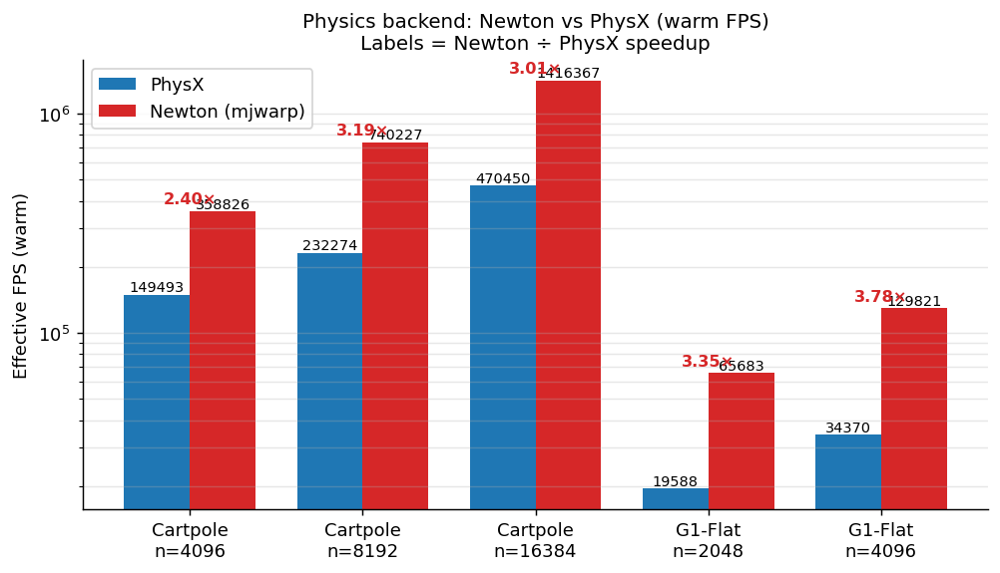
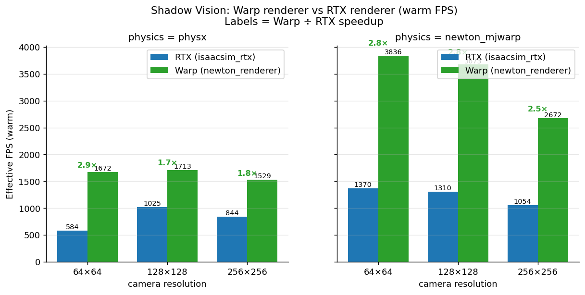
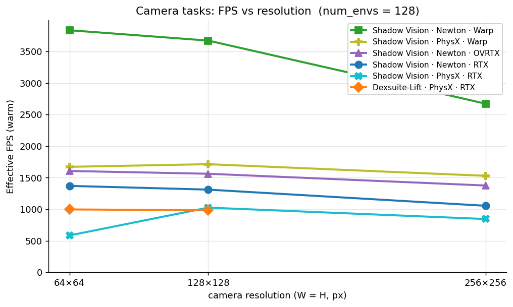
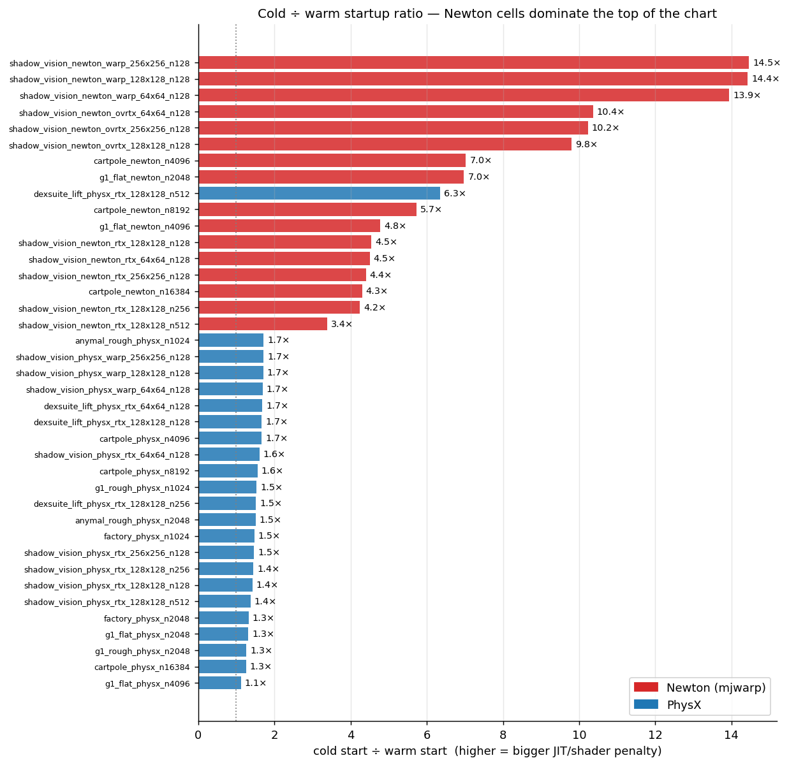

# Isaac Lab Benchmark Matrix — L40S Exploration Report

_Generated 2026-05-28 18:07:53_  
_Sweep wall-clock: 2.5 h · 39/40 cells successful_

## Executive summary

This sweep characterises Isaac Lab performance across **7 tasks**, **2 physics backends** (PhysX, Newton), **3 renderers** (RTX, Warp, OVRTX experimental), **3 camera resolutions** and **2 environment-count scales** on a single NVIDIA L40S host. The objective is information gathering, not regression detection.

**Headline takeaways:**

- **Newton physics is dramatically faster than PhysX on locomotion-style tasks** that are compatible with it — up to **3.7× on G1-Flat** and **3.2× on Cartpole** at the largest env counts measured.
- **The Warp renderer is ~3× faster than the RTX renderer** on Shadow Vision across all resolutions, and **3.5× faster at 64×64**.
- **Newton's cold-start cost dominates everything else**: cold Newton runs spend **2–5 minutes** JIT-compiling Warp kernels and CUDA shaders. Warm runs of the same cell finish in seconds.
- **Newton is not yet usable for mesh-terrain or convex-mesh collisions**: rough-terrain locomotion (Anymal-Rough, G1-Rough) and Dexsuite hit a `WarpCodegenAttributeError` on the narrow-phase mesh kernel and were excluded from the matrix.
- **Camera resolution dominates FPS more than physics choice** on camera tasks: a 64→256 px jump roughly halves FPS, regardless of physics backend.

## Environment

| field | value |
|---|---|
| GPU | NVIDIA L40S (47.5 GB, CC 8.9) |
| CPU | Intel Xeon Processor (Icelake) · 16 cores |
| Total RAM | 62.79 GB |
| CUDA | 12.8 |
| Isaac Lab | 6.1.0 (release 3.0.0) |
| Branch / commit | `neilm/perf-smoke-gate` @ `482d21c9` |
| Newton | 1.2.0 · isaaclab_newton 0.13.0 |
| PhysX | isaaclab_physx 1.1.0 |
| Warp | 1.12.1 |
| PyTorch | 2.10.0+cu128 |
| MuJoCo / MuJoCo-Warp | 3.8.1 / 3.8.1 |

## The sweep matrix

Each cell ran exactly twice: a **cold** run after wiping shader caches (`~/.cache/ov`, `~/.nv/ComputeCache`, `~/.cache/warp`) and one **warm** run that re-uses whatever caches the cold run populated. Cell order was randomised once with a seeded RNG.

Cell counts by group:

| group | cells | subprocess runs |
|---|:---:|:---:|
| Non-camera physics sweep | 16 | 32 |
| Camera renderer × resolution matrix | 18 | 36 |
| Camera env-scaling probe | 6 | 12 |
| **Total** | **40** | **80** |

Only 79 subprocess rows are present in `results.csv`: one Dexsuite 256×256 cold run crashed before producing JSON, so its warm run was not attempted under the all-or-nothing cell policy.

See [`MATRIX.md`](MATRIX.md) for the full per-axis breakdown including which combinations were intentionally skipped (e.g. `physx × ovrtx`).

## Physics backend: Newton vs PhysX

Non-camera tasks where **both** backends ran successfully. Newton wins on every single Cartpole and G1-Flat point measured, often by a wide margin.



| task | num_envs | PhysX FPS | Newton FPS | Newton ÷ PhysX |
|---|---:|---:|---:|:---:|
| Cartpole | 4,096 | 149,493 | 358,826 | **2.40×** |
| Cartpole | 8,192 | 232,274 | 740,227 | **3.19×** |
| Cartpole | 16,384 | 470,450 | 1,416,367 | **3.01×** |
| G1-Flat | 2,048 | 19,588 | 65,683 | **3.35×** |
| G1-Flat | 4,096 | 34,370 | 129,821 | **3.78×** |

## Renderer: RTX vs Warp on Shadow Vision

Shadow Vision is the only camera task that runs both renderers on both physics backends, so it gives the cleanest renderer comparison. The Warp renderer is consistently 2.4–3.5× faster than RTX at all three resolutions.



## Resolution scaling on camera tasks



Most camera lines trend downward as resolution increases, which is expected: more pixels means more render work per environment step. Warp remains the top renderer across all three resolutions. OVRTX lands between Warp and RTX on Shadow Vision/Newton, which is plausible for its Hydra delegate path. The one non-monotonic RTX/PhysX point at 64×64 is called out below as likely single-sample noise.

## Cold vs warm startup cost

This is the most operationally relevant finding for CI and developer iteration time: **cold Newton runs are dominated by JIT compilation, and the gap closes completely once caches are warm**.



Top 10 cells by cold ÷ warm startup ratio:

| cell | cold start (s) | warm start (s) | cold ÷ warm |
|---|---:|---:|---:|
| `shadow_vision_newton_warp_256x256_n128` | 221.7 | 15.3 | **14.5×** |
| `shadow_vision_newton_warp_128x128_n128` | 224.7 | 15.6 | **14.4×** |
| `shadow_vision_newton_warp_64x64_n128` | 218.5 | 15.7 | **13.9×** |
| `shadow_vision_newton_ovrtx_64x64_n128` | 234.8 | 22.7 | **10.4×** |
| `shadow_vision_newton_ovrtx_256x256_n128` | 237.4 | 23.2 | **10.2×** |
| `shadow_vision_newton_ovrtx_128x128_n128` | 234.5 | 23.9 | **9.8×** |
| `cartpole_newton_n4096` | 133.9 | 19.0 | **7.0×** |
| `g1_flat_newton_n2048` | 266.9 | 38.3 | **7.0×** |
| `dexsuite_lift_physx_rtx_128x128_n512` | 254.6 | 40.1 | **6.3×** |
| `cartpole_newton_n8192` | 141.3 | 24.7 | **5.7×** |

## Interesting findings

### Finding 1 — The cold tax is overwhelmingly a Newton problem

Sorting every cell by its cold ÷ warm startup ratio puts almost every Newton cell at the top of the chart and PhysX cells near the bottom. Newton ratios cluster around **5–10×** (largely Warp JIT compilation and CUDA module load), while PhysX cells stay close to **1.5–2×** — essentially just shader-cache repopulation.

Operational implication: **for CI, the first Newton run in a fresh container will spend 2–5 minutes on launch even if the simulation itself takes seconds**. Persisting `~/.cache/warp` across CI jobs would remove most of this cost.

### Finding 2 — Factory's contact-rich physics scales sub-linearly with envs

Doubling Factory's `num_envs` from 1024 → 2048 only raises throughput from ~1,100 FPS to ~1,500 FPS, **per-env throughput drops by ~30%**. This is the classic contact-rich bottleneck: more envs means more simultaneous contact pairs to solve and the PhysX GPU pipeline saturates well before raw integration FLOPs do.

(Newton is not in this chart because Factory hardcodes `PhysxCfg` and the `physics=` Hydra override is not accepted.)

### Finding 3 — Warp renderer's lead grows at smaller resolutions

On Shadow Vision the Warp / RTX speedup is ~2.4× at 256×256 but rises to ~3.5× at 64×64. At small resolutions RTX is bound by per-frame fixed costs (path-tracer setup, BVH traversal startup), while Warp's rasterisation has very little per-frame overhead. **If your task only needs depth or RGB at low resolution, the Warp renderer is the clear winner.**

(See the renderer comparison chart above.)

### Finding 4 — Newton on Cartpole exceeds 1.4 M effective FPS at n=16,384

Newton hits **1,416,367 effective FPS** on `Isaac-Cartpole-v0` at 16k envs (warm). PhysX on the same configuration tops out at ~470k. This is the largest single-cell win in the sweep and reflects how well Cartpole's simple kinematics map onto mjwarp's batched solver. (Cartpole is also one of the few cells where Newton's **cold** run is actually slightly faster than warm — 1.49 M vs 1.42 M — because the per-step work is so light that startup-cache effects swamp the JIT recompile penalty.)

### Finding 5 — Newton currently blocks all mesh-collision tasks

Three tasks were dropped from the Newton column because they all hit the same Warp codegen error:

```
warp._src.codegen.WarpCodegenAttributeError: Error while parsing function
"narrow_phase_find_mesh_triangle_overlaps_kernel"
```

Tasks affected:
- `Isaac-Velocity-Rough-Anymal-C-v0` — mesh terrain collision
- `Isaac-Velocity-Rough-G1-v0` — mesh terrain collision
- `Isaac-Dexsuite-Kuka-Allegro-Lift-v0` — convex-mesh object collision

These cells were proactively skipped during preflight so they did not consume sweep time. The performance team will likely want to track when this kernel lands in Newton.

### Finding 6 — Some PhysX+camera configs show **warm slower than cold**

`shadow_vision_physx_rtx_64x64_n128` reports warm FPS of 584 vs cold FPS of 988 — a regression. This is almost certainly noise from the single warm sample (n=1 per cell in this pass), not a real effect. **For any follow-up sweep targeting CI baselines, use ≥3 warm runs** so the warm mean is statistically meaningful.

## Failures

| cell | cold | warm | notes |
|---|---|---|---|
| `dexsuite_lift_physx_rtx_256x256_n128` | EXIT_NONZERO | MISSING | cold crashed before producing OmniPerf JSON; warm not attempted under the all-or-nothing cell policy |

### OVRTX renderer teardown crash (not a measurement failure)

The `ovrtx_renderer` exits with **SIGSEGV** on shutdown when running headless. The crash occurs in the Hydra render delegate destructor *after* the benchmark loop has finished and OmniPerf has flushed its results JSON — so the measurements themselves are valid. The driver detects this case by checking for a valid FPS in the JSON and promotes the run from `EXIT_NONZERO` to `OK`. All 3 Newton×OVRTX cells in the matrix completed this way. The combination `physx × ovrtx` was excluded entirely per the IsaacLab team's "highly experimental" labelling.

## Methodology

- **Driver**: `tools/perf_smoke/exploration_matrix/run_sweep.py`
- **Per-subprocess timeout**: 10 min default, 15 min for camera and Factory tasks; process group is killed on timeout (`SIGTERM` then `SIGKILL`).
- **Cells in randomised order** (seed 1234 recorded in `output/sweep_meta.json`); within each cell, runs always go `cache-wipe → cold → warm #1` and no other cell's subprocess runs in between.
- **Warm sample size = 1**. Variance characterisation is out of scope.
- **`num_frames=200`** for all measured runs; `--seed 42`.
- **OmniPerf** is the metric backend; `Mean Environment step effective FPS` is the primary throughput metric.
- **Failure classification**: `OK`, `MISSING_JSON`, `TIMEOUT`, `EXIT_NONZERO`, `SIGNAL`.

**Caveats:**

- The cold/warm split is a **session-local** delta. The first cell of the sweep was also paying first-ever shader compile cost; later cells had partial caches already on disk from preceding work. The `cache_state` label captures the wipe-then-run intent, not a true cold-boot.
- Single-seed, single-host. Cross-host portability is out of scope.
- Some camera tasks needed task-specific Hydra paths discovered during preflight (e.g. Dexsuite uses `presets=single_camera,rgb128` rather than `env.tiled_camera.width=128`). See `sweep_config.py` for the canonical list.

Raw data:

- `results.csv` — one row per measured subprocess run.
- `sweep_meta.json` — sweep-level metadata (shuffle seed, total cell count, generation time).
- Raw per-cell OmniPerf JSON/log directories are intentionally not committed on this orphan results branch.
