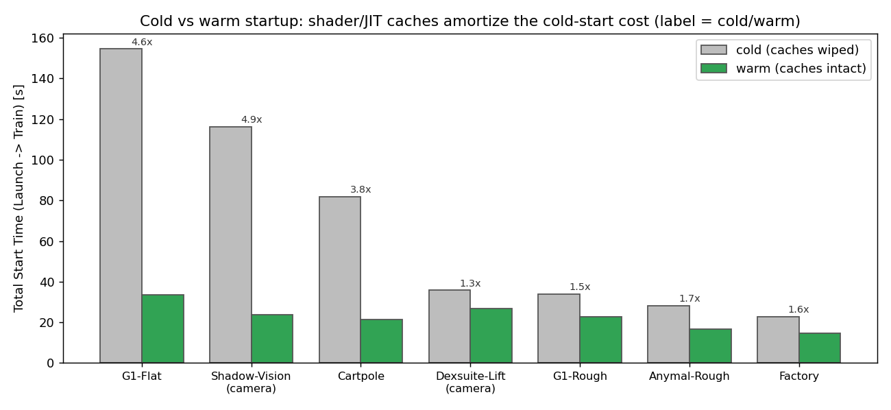
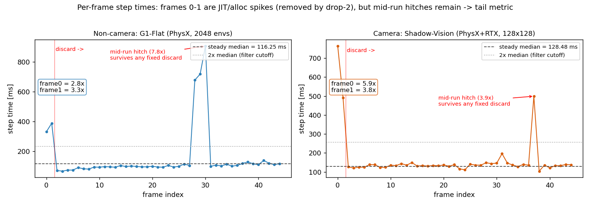
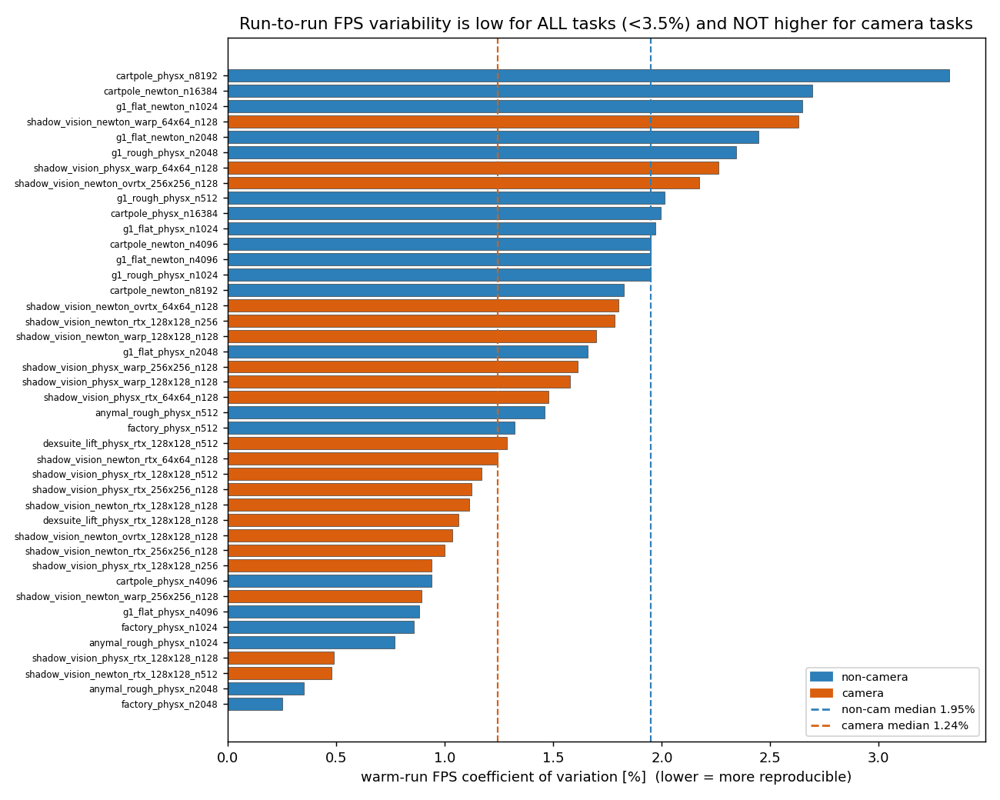
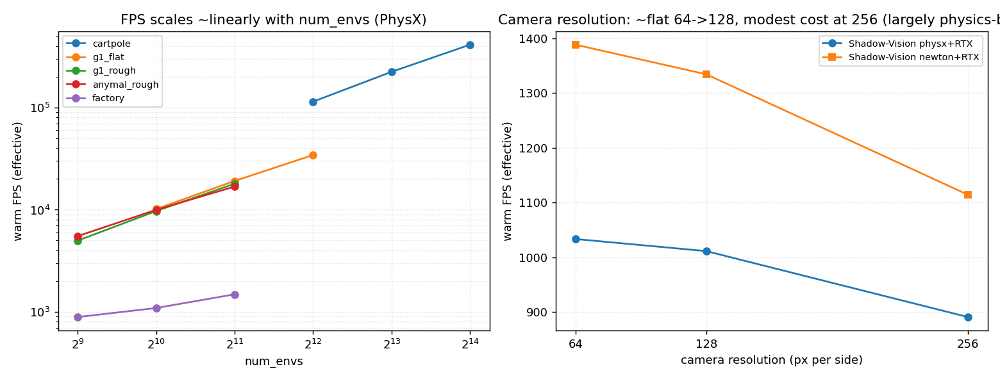

# Phase 1 Perf Gate — Matrix Sweep Analysis

**Dataset:** 45 cells × (1 cold + 5 warm) = 256 subprocess runs, json backend (500 frames each, per-frame step times saved).
**Hardware:** single NVIDIA L40S.
**Code state:** `develop` @ `482d21c`.
**Published:** orphan branch `neilm/perf-matrix-data` (`SWEEP_MANIFEST.md`, `sweep_config.py` committed alongside the raw `output/`).
**Reproduce:** `analyze_full.py` → `results_full.csv` (per run) + `cell_summary.csv` (per cell); `make_figures.py` → `output/figures/`.

This report uses our **own** matrix data to justify the Phase 1 gate shape (warm-only, drop-2, retry policy, BLOCK/WARN/INFO tiers) and to derive a CI timing budget. Where the data contradicts our earlier assumptions, that is called out explicitly.

> **TL;DR of the surprises**
> 1. **Run-to-run FPS variance is *not* higher for camera tasks** — non-camera median CV is actually higher (1.95% vs 1.24%). The "vision = noisier FPS" premise does not hold at the FPS-mean level, so `vision ×3` needs a different justification (it gets one: cold-start amortization + crash-proneness, not FPS noise).
> 2. **Variance does not shrink monotonically with more warm reps** (8/21 non-camera, 5/20 camera cells). Adding reps past ~3 buys little FPS-mean precision.
> 3. **Intrinsic tails are a *physics* phenomenon, not a camera one** — the heaviest tails are locomotion/contact (Factory kurtosis ≈470, G1/Anymal ≈170–210), while camera tasks are moderate (≈110–180).

---

## 1. Dataset & reliability

| | count |
|---|---:|
| Subprocess runs collected | 256 |
| `OK` | 252 (98.4%) |
| `EXIT_NONZERO` | 4 |

All 4 failures are `Dexsuite-Lift` cells crashing intermittently (exit 250 / SIGABRT, `malloc(): unaligned tcache chunk` — heap corruption in the task, not the harness). The primary Dexsuite gate cell (`128×128, 128 envs`) completed all 6 of its runs, so every task has a usable gate cell. **Implication:** Dexsuite is crash-prone independent of load — a direct argument for treating runtime crashes as a first-class `BLOCK` (hard-failure) condition and for retrying camera/dexterous cells.

---

## 2. Per-task gate cells (config + measured cost)

The representative cell we would gate on per task, with measured warm performance and cost:

| Task | envs | warm FPS | warm CV% | cold start | warm start | warm wall | exceed@2× | kurtosis |
|---|---:|---:|---:|---:|---:|---:|---:|---:|
| Cartpole (PhysX) | 4096 | 114,469 | 0.94 | 17.7 s | 10.9 s | 37 s | 0.00% | −0.1 |
| G1-Flat (PhysX) | 2048 | 19,147 | 1.66 | 38.5 s | 30.4 s | 94 s | 0.61% | 171 |
| G1-Rough (PhysX) | 1024 | 9,710 | 1.95 | 33.8 s | 22.8 s | 85 s | 0.61% | 173 |
| Anymal-Rough (PhysX) | 1024 | 9,984 | 0.77 | 28.3 s | 16.5 s | 76 s | 0.41% | 211 |
| Factory (PhysX) | 512 | 890 | 1.32 | 17.5 s | 11.0 s | 315 s | 0.20% | 470 |
| Shadow-Vision (PhysX+RTX) | 128 | 1,011 | 0.49 | 26.3 s | 18.0 s | 95 s | 0.41% | 112 |
| Dexsuite-Lift (PhysX+RTX) | 128 | 974 | 1.06 | 33.3 s | 20.3 s | 98 s | 0.20% | 179 |

Why the matrix covers what it does (env sizes 512–16384, resolutions 64²–256², PhysX + Newton, RTX/Warp renderers): so the config choices below are grounded in our own measurements rather than asserted. The full grid is in `sweep_config.py`.

---

## 3. Cold vs warm: gate on warm steady state

- **Cold startup is expensive and highly variable by task; warm is cheap and uniform.** Cold→warm startup shrinks 3.8–4.9× for the JIT/shader-heavy tasks (Cartpole 3.8×, Shadow-Vision 4.9×, G1-Flat 4.6×) and ~1.3–1.7× for the rest. The cold cost is dominated by one-time compilation: **Newton/Warp kernel JIT** (G1-Flat cold ≈155 s is the *largest* in the sweep, above any camera task) and **RTX shader compilation** (Shadow-Vision ≈117 s cold). Warm runs reuse `~/.cache/ov`, `~/.nv/ComputeCache`, `~/.cache/warp`, collapsing all tasks to a ~11–30 s startup band.
- **Steady-state FPS is identical cold vs warm** (median Δ = +0.0–0.1% across all cells). The cache state changes *startup*, not *throughput*.

**→ Gate decision:** measure on **warm runs only**. Cold startup is real engineering cost but it is amortized by a shared CI cache and is not the signal we regress on; warm steady-state FPS is both the stable and the meaningful quantity.

---

## 4. Data shape & signal cleaning: drop-2 cleans FPS, but not tails

Reading the raw per-frame trace (from **repeated warm runs**, so these are not cold-start artifacts):

- **Frames 0–1 are one-time JIT/allocation spikes.** Median ratios to the steady median: non-camera `frame0 ≈ 3.4×, frame1 ≈ 3.2×`; camera `frame0 ≈ 11.2×, frame1 ≈ 8.6×` (rendering pipeline warm-up is an order of magnitude worse). By **`frame2` the trace is already at steady state** (≈0.7× non-camera, ≈1.05× camera).
- **→ Dropping the first 2 frames is safe and sufficient** to clean the FPS/median metric: it removes exactly the startup transient and nothing structural.
- **But mid-run hitches survive any fixed discard.** Both example traces show spikes *after* the warm-up window (G1-Flat ≈7.8× at frame ~28; Shadow-Vision ≈3.9× at frame ~37). These recur across warm reps, so they are a property of the workload, not noise or cache state. **No "drop first N frames" rule can remove them** — they appear in the middle of the run.

**→ Gate decision:** `drop-2` is the discard policy for the **scale** metric. Tail events are a *separate* phenomenon that a discard policy cannot address, which is the entire motivation for a dedicated **tail check (WARN tier)** rather than folding everything into one cleaned FPS number.

---

## 5. Run-to-run variance: low everywhere, and *not* worse for camera

This is the section that contradicts our prior assumption.

- **Warm FPS is highly reproducible across the board:** every one of 42 cells has warm CV < 3.4%, and the median is ~1.5%.
- **Camera tasks are not noisier than non-camera tasks at the FPS-mean level.** Median CV is **1.95% non-camera vs 1.24% camera** — i.e. if anything camera tasks are *more* reproducible in FPS. The two populations are fully interleaved in the figure; the noisiest cells are large-batch Cartpole/Newton and small-env locomotion, not the camera cells.
- **More warm reps do not monotonically reduce variance.** CV after 5 reps is lower than after 2 reps in only **8/21 non-camera** and **5/20 camera** cells. Past ~3 reps, extra warm runs mostly cost wall-time without tightening the FPS estimate.

**→ Gate decision — `vision ×3` survives, but for different reasons.** The original justification ("vision has higher FPS variance") is **not supported**. The defensible reasons to repeat camera/dexterous tasks more are:
  1. **Crash-proneness** — all 4 sweep failures were the camera/dexterous Dexsuite task (§1); repetition raises the chance of getting a clean run.
  2. **Cold-start amortization makes extra warm reps cheap** — the expensive cost for camera tasks is the one-time ~100 s cold compile (§3), not each warm rep, so 3 warm reps is a small marginal cost on top of an already-paid startup.
  3. **Tail confidence** — the WARN-tier tail metric (§6) benefits from more samples, and camera/contact tasks are where rare large spikes live.

  Non-vision `×1` is justified directly: those tasks are cheap, reproducible (CV ≈ 1–2%), and rarely crash. (A conservative `×2` for the higher-CV locomotion cells is a reasonable option but not required by the data.)

---

## 6. Tail characterization: an intrinsic, physics-driven floor

The intrinsic (no-regression) tail behavior sets the false-positive floor the WARN tier must clear:

- **Exceedance@2× is small for every task** (0.00–1.02% of frames), so a tail threshold set at a few × the per-task baseline will not fire on normal noise.
- **The heavy tails are physics, not rendering.** Excess kurtosis is highest for **Factory (≈470)** and the **locomotion** tasks (G1/Anymal ≈170–210) — contact-rich dynamics produce rare large step-time spikes. Cartpole is effectively tail-free (kurtosis ≈ 0). Camera tasks sit in the middle (≈110–180), **not** at the top. This refines our earlier framing: the tail metric is most load-bearing for **contact/locomotion**, and the camera tasks earn their tail check by magnitude of individual hitches (§4) rather than by exceedance rate.

**→ Gate decision:** tail thresholds must be **per-task baselines** (k=2.0, fixed 10-frame warmup discard), not a single global cutoff — Factory's natural kurtosis would otherwise look like a regression next to Cartpole's. This is exactly the `tail` block schema already in `baseline.json`.

---

## 7. Scaling & CI timing budget

- **FPS scales ~linearly with `num_envs`** (log-log slope ≈ 1) for every non-camera task: Cartpole 114k→413k over 4096→16384 envs; G1-Flat 10k→34k over 1024→4096. Throughput-per-env is roughly constant, so the env-count choice is about GPU saturation and per-cell wall-time, not about a "fair" comparison point — any of the three sizes is representative.
- **Camera resolution is largely physics-bound at gate scale.** Shadow-Vision FPS is flat from 64²→128² and drops only ~14% (PhysX) / ~20% (Newton) at 256². At 128 envs the workload is dominated by physics/scene, not fill rate — **128×128 is a sound gate resolution** (no speedup below it, meaningful cost above it).
- **Timing budget:** one warm run across all 45 cells totals **79 min**; the gate set (7 representative cells) is far smaller. **Factory dominates** (315 s/run at 512 envs, growing to 746 s at 2048) — it alone argues for keeping Factory at the smallest env size in CI. With `1 cold + warm reps` per gate cell, a full gate pass is on the order of **30–45 min wall-time** on one L40S, which is practical for a nightly/pre-merge gate.

---

## 8. How the data maps onto the gate

| Decision | Evidence |
|---|---|
| **Warm runs only** | Steady-state FPS identical cold vs warm; cold cost is one-time JIT/shader compile, amortized by shared cache (§3). |
| **Drop first 2 frames** | `frame0/1` are 3–11× the steady median, `frame2` is already steady (§4). |
| **Non-vision ×1** | Warm CV ≈ 1–2%, no crashes, cheap (§5). |
| **Vision ×3** | *Not* FPS variance (that's comparable). Justified by crash-proneness, near-free extra warm reps after the cold compile, and tail-sample confidence (§1, §3, §5). |
| **BLOCK: robust FPS regression** | FPS-mean/median is reproducible (CV<3.4%) and outlier-resistant → a clean, low-false-positive scale signal (§5). |
| **BLOCK: hard failures** | Dexsuite's intermittent SIGABRT shows crashes are real and must fail the gate, not be silently dropped (§1). |
| **WARN: tail/outlier** | Mid-run hitches survive any discard and recur across reps (§4); intrinsic exceedance is low (<1%) so a per-task threshold won't false-fire (§6). |
| **Per-task tail baselines** | Kurtosis spans ≈0 (Cartpole) to ≈470 (Factory) — a global threshold is impossible (§6). |
| **INFO: provenance/diagnostics** | Cold/warm split, startup stages, scaling all vary by task and config and are worth logging for triage (§2, §3, §7). |

### Open items for the report draft
- §6 (#5265 scale) and §7 (#5677 tail) of the *team* report still need the regression-vs-baseline deltas; those come from the dedicated 5265 control + synthetic-5677 step-shape work, not this sweep.
- Optional: pull matching OmniPerf historical cells to cross-check the env/resolution config choices against production data.
